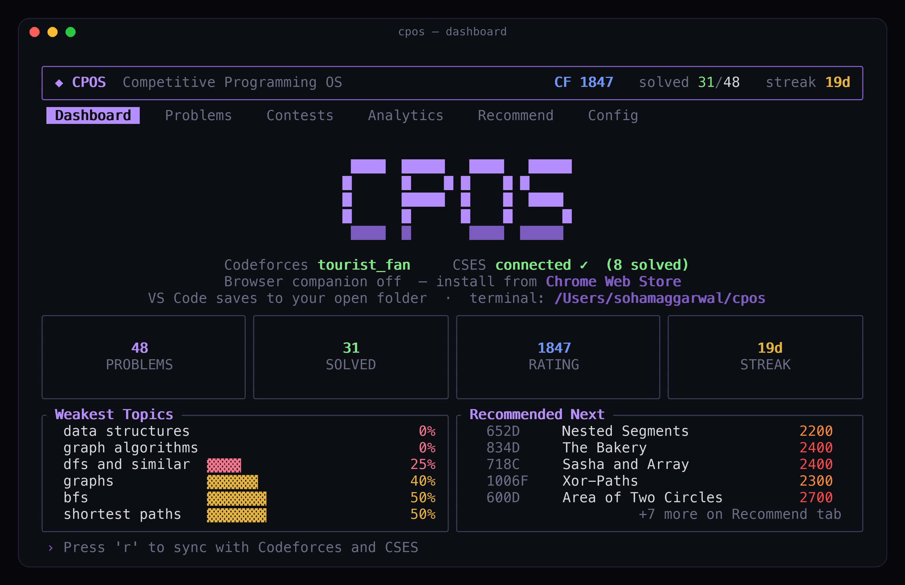

<h1 align="center">CPOS</h1>

<p align="center"><b>Competitive Programming Operating System</b></p>

<p align="center">
Open a problem in your browser. CPOS creates the file, loads the samples, and lets you run and submit — without copy-pasting anything.
</p>

<p align="center">
  <a href="https://cpos.sohamaggarwal.com"></a>
  <a href="https://marketplace.visualstudio.com/items?itemName=sohamaggarwal.cpos-vscode"></a>
  <a href="https://chromewebstore.google.com/detail/gjnbapmjonegeeamdeahcoojgokeogmm"></a>
  
  
</p>

<p align="center">
  
</p>

---

## How it works

CPOS has three parts: a **browser companion**, a **VS Code extension**, and a **terminal app**. You need the browser companion no matter which workflow you pick. The other two do the same job in different ways — use one, or both together.

**The flow is always the same:**

1. **Pick your folder** — open any folder in VS Code, or let the terminal app use `~/cpos`. That's where your solution files live.
2. **Open a problem in your browser** — go to any Codeforces or CSES problem page like you normally would.
3. **CPOS captures it** — the browser companion reads the public samples off the page and sends them to CPOS on your computer (nothing goes to the cloud).
4. **A file appears automatically** — e.g. `1971D.cpp` or `WeirdAlgorithm.cpp`, created right in your folder, with the sample tests attached.
5. **Write your solution** — in VS Code or whatever editor you use.
6. **Run your samples** — check `AC` / `WA` / `TLE` before you submit.
7. **Submit** — CPOS sends your code to the submit page in your browser and fills the form for you (you must be logged in to Codeforces/CSES in that browser).

That's it. No copying sample input from the problem page. No manually creating files.

---

## Two ways to work — pick what feels right

Both paths capture problems, run tests, and submit. Use whichever you prefer.

### VS Code — click to run and submit

Good if you like solving in an editor with a side panel and buttons.

1. Install the [VS Code extension](https://marketplace.visualstudio.com/items?itemName=sohamaggarwal.cpos-vscode) and the [browser companion](https://chromewebstore.google.com/detail/gjnbapmjonegeeamdeahcoojgokeogmm).
2. Open the **folder** you want your files in.
3. Open a problem in your browser → the solution file opens in VS Code with samples loaded.
4. Use the **CPOS panel** (activity bar on the left):
   - **Run All** — compile and test every sample
   - **Submit** — autofill the judge submit page
   - **Problem** — jump back to the statement

You click buttons. Samples show pass/fail inline in the panel.

### Terminal — keyboard commands

Good if you like a full-screen command center: browse problems, track rating, see contests, get recommendations — all without leaving the terminal.

```bash
cargo install --git https://github.com/Soham109/cpos
cpos
```

Install the [browser companion](https://chromewebstore.google.com/detail/gjnbapmjonegeeamdeahcoojgokeogmm) too, so browser captures still work.

| Key | What it does |
| --- | --- |
| `o` / `Enter` | Open a problem — creates the file, loads samples, opens your editor |
| `T` | Run against samples |
| `s` | Submit |
| `b` | Open problem in browser |
| `U` | Open by URL |
| `/` · `f` · `p` | Search · filter by rating · switch platform |
| `Tab` | Switch between Dashboard, Problems, Contests, Analytics, Recommend |
| `r` | Sync with Codeforces and CSES |

You press keys instead of clicking. Same capture, same submit — just a different interface.

### Using both together

Run the terminal app **and** the VS Code extension at the same time if you want. The terminal tracks your progress, rating, and recommendations. VS Code is where you write code with the side panel. They talk to each other over localhost and stay in sync.

---

## Your folder, your files

You choose where files go:

- **VS Code:** open any project folder before you capture. CPOS creates `1971D.cpp` (or whatever the problem is) right inside it. No forced workspace, no extra setup.
- **Terminal app:** defaults to `~/cpos/`, or point it at any directory you like.

Change the save location anytime in **Settings → Extensions → CPOS** (`cpos.saveLocation`, `cpos.fixedDir`).

---

## Install

| What | Where |
| --- | --- |
| Browser companion | [Chrome Web Store](https://chromewebstore.google.com/detail/gjnbapmjonegeeamdeahcoojgokeogmm) (also works in Edge/Brave) |
| VS Code extension | [VS Code Marketplace](https://marketplace.visualstudio.com/items?itemName=sohamaggarwal.cpos-vscode) |
| Terminal app | `cargo install --git https://github.com/Soham109/cpos` |

Minimum setup: **browser companion + one of VS Code or terminal**. All three together is the full experience.

<p align="center">
  
  
  
  
</p>

---

## Features

- **Auto file creation** — open a problem, get a ready-to-edit solution file in your folder
- **Sample capture** — public tests pulled from the problem page automatically
- **Run & submit** — from the VS Code panel or terminal keys; submit autofills your browser
- **13 languages** — C, C++, Python, PyPy, Java, Kotlin, Rust, Go, C#, JS, Ruby, Haskell, Pascal
- **Progress & analytics** — rating history, topic breakdown, activity heatmap
- **Recommendations** — up to 30 personalized problems aimed at your weak topics (see below)
- **Contests** — upcoming and running Codeforces contests with countdowns
- **Private** — everything stays on your machine (`127.0.0.1`, no external servers)

---

## Recommendations

After you sync (`r` in the terminal), CPOS builds a list of **30 unsolved problems** to practice next. Find them on the **Recommend** tab or the **Recommended Next** panel on the Dashboard.

### How problems are picked

CPOS only considers **unsolved** problems with a Codeforces rating in a band around your level (roughly −250 to +350 from your current rating, targeting about +100 above you).

Each candidate gets a score from:

| Signal | What it means |
| --- | --- |
| **Weak topics** | Tags where your solve rate is low get the most weight — a topic you fail 100% of the time counts more than one you're half-comfortable with |
| **Multiple weak tags** | Problems that combine several weak areas get a small bonus |
| **Unfinished attempts** | Problems you tried but didn't solve are boosted so you can finish what you started |
| **Rating fit** | Problems near your target practice rating score higher |
| **Popularity** | Well-known problems (many solves on Codeforces) are preferred — they're usually better written |

The top scorers are then **diversified**: CPOS caps how many problems share the same primary tag or exact rating so the list isn't fifteen identical DP problems.

### Cold start (no solves yet)

If you haven't accepted anything yet, CPOS can't infer weak topics. It falls back to **popular problems around 1200**, spread across tags and ratings, until your submission history fills in.

Press **`r`** after solving more problems to refresh recommendations.

---

## Settings

**VS Code** — `Settings → Extensions → CPOS`:

| Setting | Default | What it does |
| --- | --- | --- |
| `cpos.saveLocation` | `workspaceFolder` | Save files in your open folder |
| `cpos.fixedDir` | `~/cpos` | Folder when save location is `fixed` |
| `cpos.defaultLanguage` | `cpp` | Language for new files |
| `cpos.runTimeoutMs` | `5000` | Per-test timeout |

**Terminal app** — `~/.config/cpos/config.toml` (Linux) or `~/Library/Application Support/cpos/config.toml` (macOS):

```toml
default_language = "cpp"
theme = "purple"
editor = "code {file}"

[handles]
codeforces = "your_handle"
```

> **macOS C++:** run `brew install gcc` if you need `bits/stdc++.h` — CPOS auto-detects Homebrew's g++.

---

## Roadmap

- AtCoder & CodeChef support
- Contest mode with per-problem timers
- Read submission verdicts back into CPOS

---

## License

MIT — see [LICENSE](LICENSE).

---

## Open source

CPOS is fully open source. You're free to use it, fork it, and build on it.

Contributions are welcome and appreciated — whether that's a bug report, a doc fix, a new platform, or a polish pass on the TUI. If you want to help, read **[CONTRIBUTING.md](CONTRIBUTING.md)** for project layout, dev setup, and PR guidelines.

Questions or ideas: [GitHub Issues](https://github.com/Soham109/cpos/issues).
