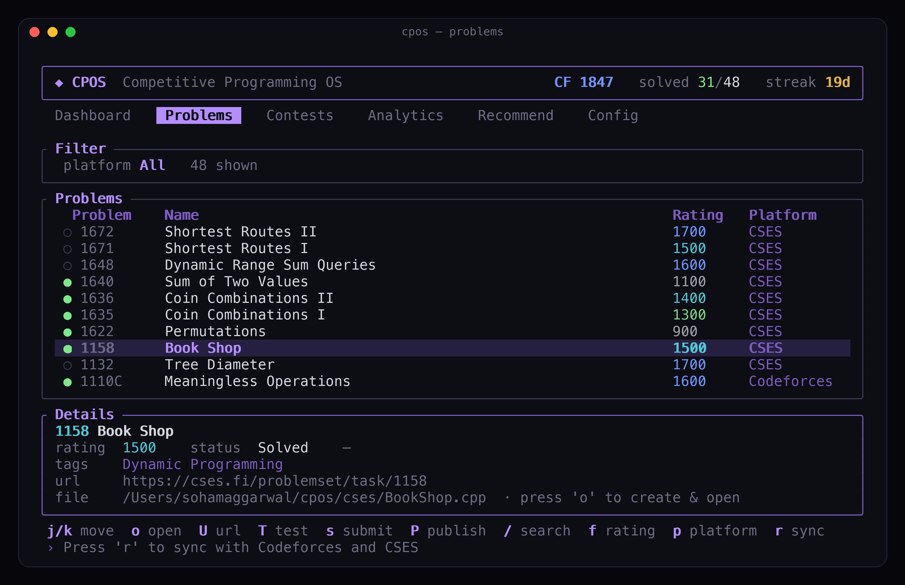
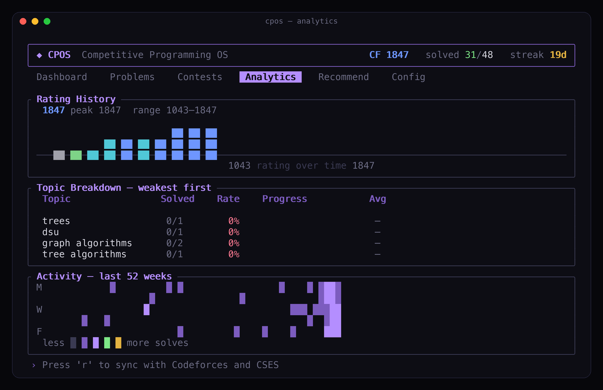
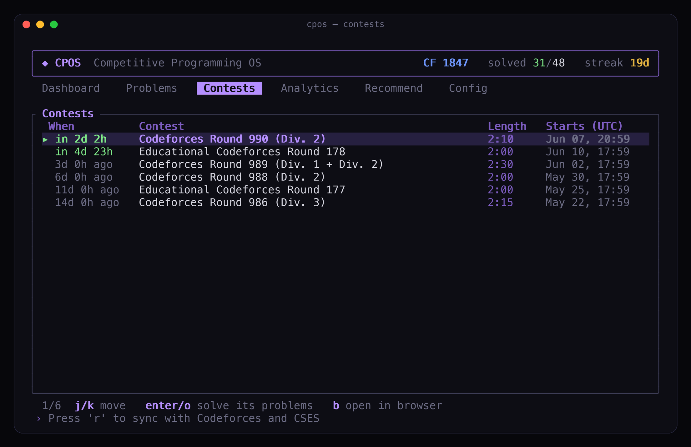
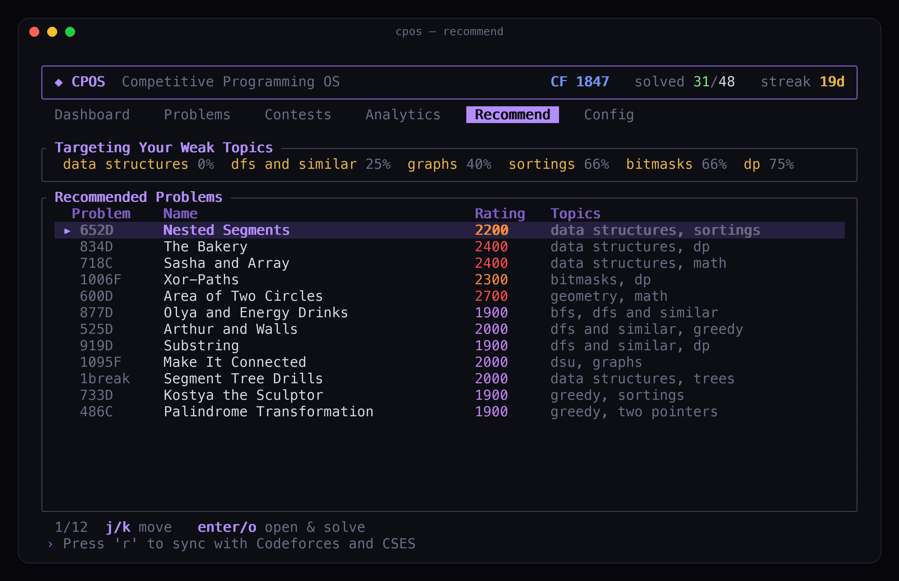

<h1 align="center">CPOS</h1>

<p align="center"><b>Competitive Programming Operating System</b></p>

<p align="center">
Open a problem in your browser. CPOS creates the file, loads the samples, and lets you run and submit — without copy-pasting anything.
</p>

<p align="center">
  <a href="https://cpos.sohamaggarwal.com"></a>
  <a href="https://youtu.be/5HTatBfpK5A"></a>
  <a href="https://marketplace.visualstudio.com/items?itemName=sohamaggarwal.cpos-vscode"></a>
  <a href="https://chromewebstore.google.com/detail/gjnbapmjonegeeamdeahcoojgokeogmm"></a>
  <a href="extensions/firefox"></a>
  
  
  <a href="https://github.com/sponsors/Soham109"></a>
</p>

## Demo

<p align="center">
  <a href="https://youtu.be/5HTatBfpK5A">
    
  </a>
</p>

<p align="center">
  <a href="https://youtu.be/5HTatBfpK5A">
    
  </a>
</p>

<p align="center"><sub>Capture a problem · auto-create your file · run samples · submit from VS Code</sub></p>

---

## How it works

CPOS has three parts — a **browser companion**, a **terminal app**, and a **VS Code extension**. Install all three; they share the same files and stay in sync over localhost.

**The flow:**

1. **Pick your folder** — open any folder in VS Code, or let the terminal app use `~/cpos`.
2. **Open a problem in your browser** — any Codeforces or CSES problem page.
3. **CPOS captures it** — the browser companion reads samples and sends them to CPOS on your machine.
4. **A file appears** — e.g. `1971D.cpp`, with sample tests attached.
5. **Write your solution** — in VS Code.
6. **Run samples** — from the panel or with `T` in the terminal.
7. **Submit** — CPOS autofills the judge form in your browser (log in to Codeforces/CSES first).

No copying samples. No manually creating files.

---

## VS Code

Write code in the editor. The CPOS panel runs samples and submits.

<p align="center">
  
</p>

Install from the [Marketplace](https://marketplace.visualstudio.com/items?itemName=sohamaggarwal.cpos-vscode). Open your folder, capture a problem from the browser, then use the **CPOS panel**:

- **Tests / Statement tabs** — switch between samples and the captured problem statement, rendered natively with MathJax
- **Run All** — compile and test every sample
- **Submit** — autofill the judge submit page in your logged-in browser
- **Problem** — open the statement again
- **Search** — Google search for editorials and solutions for the linked problem
- **GitHub** — open the CPOS repository
- **Test cases** — edit samples; multi-case inputs show linked input/output blocks when captured from Codeforces
- **Theme** — five panel themes (see [Settings](#settings))

---

## Terminal

Browse the catalog, sync rating, track contests, and get recommendations — without opening Codeforces in a tab.

```bash
brew tap Soham109/cpos https://github.com/Soham109/cpos
brew install cpos
cpos
```

Windows with Scoop:

```powershell
scoop bucket add cpos https://github.com/Soham109/cpos
scoop install cpos
cpos
```

| Key | What it does |
| --- | --- |
| `o` / `Enter` | Open a problem — creates the file in your project folder when VS Code has synced a path, otherwise in `~/cpos` or your configured workspace |
| `T` | Run against samples |
| `s` | Submit |
| `b` | Open problem in browser |
| `U` | Open by URL |
| `/` · `f` · `p` | Search · filter by rating · switch platform |
| `Tab` | Switch between Dashboard, Problems, Contests, Analytics, Recommend |
| `r` | Sync with Codeforces and CSES |

Keep the terminal running while you code in VS Code — same captures, same submits, same progress.

### First run

The first time you launch `cpos` (before a Codeforces handle is set) a quick 4-step wizard runs:

1. **Handle** — type your Codeforces handle.
2. **Language** — pick your default language (`←/→` to browse).
3. **Template** — choose how to supply your solution template:
   - **Paste** (default): copy your template, then press **`v`** (or `Ctrl+V` / `⌘V`) to paste the whole thing — multi-line formatting is preserved.
   - **Upload**: press **`Tab`** to switch modes, type or paste a file path, then **Enter** to load it. A live preview shows the loaded template.
   - Leave it blank to use the built-in template.
4. **CSES** *(optional)* — press `o` to open the CSES login, then paste your `PHPSESSID` cookie to sync solved problems. You can skip this and set it later in Config.

Re-run the wizard any time by clearing your handle in `config.toml` (or deleting the config file — see [Config location](TROUBLESHOOTING.md#config-location)).

---

## Your folder, your files

You choose where solution files live:

- **VS Code:** open a project folder before you capture. CPOS creates files such as `1982C.cpp` in that folder.
- **Terminal:** defaults to `~/cpos/`, or uses the same project folder as VS Code when captures have been synced.

Configure the VS Code save location under **Settings → Extensions → CPOS** (`cpos.saveLocation`, `cpos.fixedDir`). Configure the terminal workspace in `config.toml` (`workspace_dir`).

---

## Install

| What | Where |
| --- | --- |
| Browser companion | [Chrome Web Store](https://chromewebstore.google.com/detail/gjnbapmjonegeeamdeahcoojgokeogmm) (Chrome, Edge, Brave) |
| Browser companion | [Firefox source install](extensions/firefox) (temporary/self-installed for now; AMO publishing later) |
| VS Code extension | [VS Code Marketplace](https://marketplace.visualstudio.com/items?itemName=sohamaggarwal.cpos-vscode) |
| Terminal app | macOS/Linux: `brew tap Soham109/cpos https://github.com/Soham109/cpos` then `brew install cpos` |
| Terminal app | Windows: `scoop bucket add cpos https://github.com/Soham109/cpos` then `scoop install cpos` |

Install all three for the full experience. The browser companion is required for capture and submit.

The package-manager installs use prebuilt binaries from GitHub Releases, so users do not need Rust, Cargo, Visual Studio Build Tools, or a linker. Developers can still build from source with:

```bash
cargo install --git https://github.com/Soham109/cpos
```

See [INSTALL.md](INSTALL.md) for release assets, manual downloads, and publishing notes.

## Updating

When the terminal app starts, CPOS does a quick best-effort update check for the
terminal app. If the terminal app is outdated, CPOS asks before running an
update; it never updates silently. If the check is slow or offline, CPOS opens
normally.

You can also update manually:

```bash
cpos update
```

For Homebrew installs, CPOS delegates to Homebrew. For Scoop installs, CPOS delegates to Scoop. Your config, cache, templates, and problem data are kept.
Set `CPOS_NO_UPDATE_CHECK=1` to skip startup checks.

**VS Code extension** — updates from the Marketplace automatically (or **Extensions → CPOS → Update**).

**Browser companion** — Chrome/Edge/Brave update automatically from the Chrome Web Store. Firefox source installs do not auto-update yet; pull the latest repo changes, reload `extensions/firefox/manifest.json`, or rebuild/sign a new XPI.

<p align="center">
  
  
  
  
</p>

---

## Features

- **Auto file creation** — open a problem, get a ready-to-edit solution file in your folder
- **Sample capture** — public tests pulled from the problem page, with multi-case grouping on Codeforces when available
- **Run & submit** — from the VS Code panel or terminal keys; submit autofills your browser
- **Multi-language templates** — start new solutions in your configured language
- **Progress & analytics** — rating history, topic breakdown, activity heatmap
- **Recommendations** — personalized unsolved problems aimed at your weak topics (see below)
- **Contests** — upcoming and running Codeforces contests with countdowns
- **Private** — everything stays on your machine (`127.0.0.1`, no external servers)

---

## Recommendations

After you sync (`r` in the terminal), CPOS builds a focused list of unsolved problems to practice next. Find them on the **Recommend** tab or the **Recommended Next** panel on the Dashboard.

### How problems are picked

CPOS only considers **unsolved** problems with a Codeforces rating in a band around your level (roughly −250 to +350 from your current rating, targeting about +100 above you).

Each candidate gets a score from:

| Signal | What it means |
| --- | --- |
| **Weak topics** | Tags where your solve rate is low get the most weight — a topic you fail 100% of the time counts more than one you're half-comfortable with |
| **Multiple weak tags** | Problems that combine several weak areas get a small bonus |
| **Unfinished attempts** | Problems you tried but didn't solve are boosted so you can finish what you started |
| **Rating fit** | Problems near your target practice rating score higher |
| **Popularity** | Well-known problems (many solves on Codeforces) are preferred — they're usually better written |

The top scorers are then **diversified**: CPOS caps how many problems share the same primary tag or exact rating so the list isn't fifteen identical DP problems.

### Cold start (no solves yet)

If you haven't accepted anything yet, CPOS can't infer weak topics. It falls back to **popular problems around 1200**, spread across tags and ratings, until your submission history fills in.

Press **`r`** after solving more problems to refresh recommendations.

---

## Settings

**VS Code** — `Settings → Extensions → CPOS`:

| Setting | Default | What it does |
| --- | --- | --- |
| `cpos.saveLocation` | `workspaceFolder` | Save files in your open folder |
| `cpos.fixedDir` | `~/cpos` | Folder when save location is `fixed` |
| `cpos.defaultLanguage` | `cpp` | Language for new files |
| `cpos.runTimeoutMs` | `5000` | Per-test timeout |

**Panel themes** — use the theme control in the CPOS panel header. Your choice is remembered.

| Theme | Look |
| --- | --- |
| `CPOS` | Signature purple — the default |
| `Midnight` | Calm slate-blue |
| `Amber` | Warm terminal / sepia |
| `Paper` | High-contrast grayscale, minimal color |
| `Native` | Inherits your active VS Code color theme — Run All matches VS Code button styling |

**Terminal app** — `~/.config/cpos/config.toml` (Linux), `~/Library/Application Support/cpos/config.toml` (macOS), or `%APPDATA%\cpos\config.toml` (Windows):

```toml
default_language = "cpp"
theme = "purple"   # purple | cyan | green | amber | mono | plain | light
editor = "code {file}"

[handles]
codeforces = "your_handle"
```

> `plain` is a neutral grayscale theme for a low-color terminal interface; `mono` is the single-accent minimal one; `light` is a bright canvas for light terminal / VS Code light-theme users.

> **macOS C++:** run `brew install gcc` if you need `bits/stdc++.h` — CPOS auto-detects Homebrew's g++.

Having issues? See **[TROUBLESHOOTING.md](TROUBLESHOOTING.md)** (TUI install, Run All errors, submit, source builds, and more).

---

## Roadmap

- AtCoder & CodeChef support
- Contest mode with per-problem timers
- Read submission verdicts back into CPOS

---

## Sponsor

CPOS is built and maintained by one person, in the open, for the competitive programming community. It's free, MIT-licensed, and runs entirely on your own machine — no accounts, no servers, no tracking, no paywalled features.

If CPOS saves you time on every problem, sponsoring keeps it that way and funds what's next:

- **More judges** — AtCoder and CodeChef support
- **Contest mode** — per-problem timers and a focused contest workflow
- **Verdicts in CPOS** — read submission results back without leaving the editor
- **Maintenance** — keeping capture and submit working as Codeforces and CSES change

<p align="center">
  <a href="https://github.com/sponsors/Soham109"></a>
</p>

Not in a position to sponsor? Starring the repo, filing a clear bug report, or sending a PR helps just as much — see [CONTRIBUTING.md](CONTRIBUTING.md).

---

## License

MIT — see [LICENSE](LICENSE).

---

## Open source

CPOS is fully open source. You're free to use it, fork it, and build on it.

Contributions are welcome and appreciated — whether that's a bug report, a doc fix, a new platform, or a polish pass on the TUI. Start with **[CONTRIBUTING.md](CONTRIBUTING.md)** for dev setup and PR guidelines.

| Doc | Purpose |
| --- | --- |
| [INSTALL.md](INSTALL.md) | TUI binary install, update, and release publishing |
| [TROUBLESHOOTING.md](TROUBLESHOOTING.md) | Common fixes (TUI install, Run All, submit, source builds) |
| [CONTRIBUTING.md](CONTRIBUTING.md) | How to contribute |
| [ARCHITECTURE.md](ARCHITECTURE.md) | How the components connect |
| [CHANGELOG.md](CHANGELOG.md) | Version history |
| [SECURITY.md](SECURITY.md) | Report vulnerabilities |

Questions or ideas: [GitHub Issues](https://github.com/Soham109/cpos/issues).
