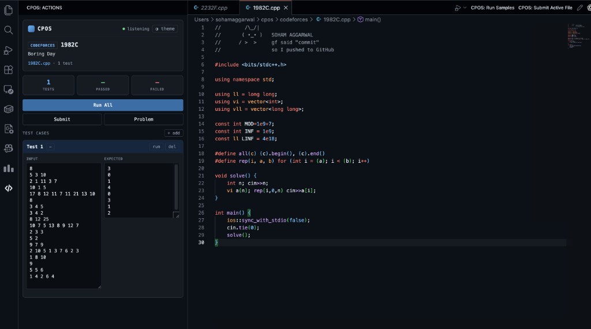

# CPOS

**Competitive programming for Codeforces and CSES — right inside VS Code.**

Open a problem in your browser. CPOS creates your solution file in the folder you have open, loads the sample tests, and gives you a side panel to run and submit.

Panel layout inspired by [CPH (Competitive Programming Helper)](https://marketplace.visualstudio.com/items?itemName=DivyanshuRaj.competitive-programming-helper).

## How it works

1. Install this extension and the [CPOS Companion](https://chromewebstore.google.com/detail/gjnbapmjonegeeamdeahcoojgokeogmm) browser extension
2. **Open the folder** where you want your solution files — any folder you like
3. Open a Codeforces or CSES problem in your browser
4. CPOS automatically creates the file (e.g. `1971D.cpp`) with samples attached and opens it in VS Code
5. Write your code, then use the **CPOS panel** to **Run All** or **Submit**

No copy-pasting samples. No manually creating files.

## The CPOS panel

Click the **CPOS** icon in the left activity bar:

- **Run All** — compile and run every sample, see `AC` / `WA` / `TLE` / `RE` / `CE` inline
- **Submit** — autofill the submit page in your logged-in browser tab
- **Problem** — open the statement again
- Edit, add, or remove test cases — saved per file

This is the click-based workflow. Prefer keyboard commands and a full progress dashboard? Install the [CPOS terminal app](https://github.com/Soham109/cpos) — both work for capture and submit, and they sync over localhost.

## Themes

Click **◑ theme** in the panel header to change how the panel looks. Your choice is saved across reloads.

| Theme | Look |
| --- | --- |
| **CPOS** | Signature purple — the default |
| **Midnight** | Calm slate-blue |
| **Amber** | Warm terminal / sepia |
| **Paper** | High-contrast grayscale, minimal color |
| **Native** | Inherits your active VS Code color theme — no custom background |

## Settings

`Settings → Extensions → CPOS` — change save folder, language, template, compile commands, timeouts.

By default, files are created in **whatever folder you currently have open** in VS Code.

Submit opens the judge in your browser; the [CPOS browser companion](https://chromewebstore.google.com/detail/gjnbapmjonegeeamdeahcoojgokeogmm) fills the form and clicks Submit (reload the unpacked extension from this repo once if Codeforces autofill fails).

## Links

- [CPOS on GitHub](https://github.com/Soham109/cpos)
- [Browser companion](https://chromewebstore.google.com/detail/gjnbapmjonegeeamdeahcoojgokeogmm)
- [Report an issue](https://github.com/Soham109/cpos/issues)
